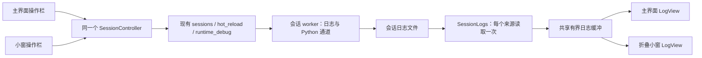

# 共用日志控件与会话控制

Windows 和 macOS 的图形会话共用一个 SessionController。启动游戏后自动显示可折叠、可置顶的小窗；主界面的“打开日志小窗”可以重新打开同一个窗口。主界面和小窗都使用原 Studio 日志颜色规则，不再维护独立的纯文本 Debug 页。

| 模块 | 责任 |
|---|---|
| mcstudio/log_colorizer.py | 原 Studio LogColorizer 的颜色分类与终端颜色，不依赖 Qt 或日志传输 |
| ui/log_view.py | LogBuffer、SessionLogs 和 LogView；单次文件读取、有限内存缓冲、富文本染色、来源/原始详情切换、搜索与前后跳转 |
| ui/session_controller.py | 会话身份、所属关系、后台任务、唯一的热更监控、Python 调用、重载与保存退出 |
| ui/session_views.py | 主界面/小窗共用的操作栏与 Python 控制台，仅负责收集用户输入和呈现状态 |
| ui/log_window.py | 展开/收起、置顶和位置偏好；小窗不创建游戏、不监听网络端口、不替换 stdout |
| ui/project_ui.py | 项目、依赖、实例选择；将游戏操作交给同一个控制器 |

颜色沿用原有规则：时间戳灰色，ERROR 红色，WARN 黄色，Engine 蓝色，自定义 Mod 标签洋红色。搜索用额外选区高亮，不改写原文的格式；清除搜索后恢复颜色。每个视图可以独立选择 game、engine、worker、operations 及是否显示协议详情，切换从共享缓冲回放，不重新打开日志文件。完整日志一直保留在项目 .runtime/sessions 中。

小窗关闭只隐藏视图，游戏与监控继续由控制器管理；重新打开没有新接收器或新监控线程。“保存退出”显式停止游戏；“重载世界”保存、部署并打开原世界。状态、忙碌标记、监控端侧在两边同步，避免两个视图重复提交操作。重载后所有视图一起绑定新会话，旧游戏日志不会混入。

管理器关闭时保存退出自己启动的游戏并关闭小窗。附加到已经运行的会话时，关闭管理器停止本 GUI 创建的监控，但保留外部游戏。停止失败会保留会话身份，允许重试；不会假报退出或强杀存档。会话自然退出时关闭小窗，完整日志仍可在主界面查看。

原 studio_server_ui.py 的 --port 入口保留为旧 Studio TCP 协议的显式适配层，复用同一个 LogWindow/LogView/LogColorizer。该入口有自己的网络服务器，但新的 Windows/macOS 托管会话均不使用它，GUI 不会再额外争抢日志端口。旧命令模式仍保留 reload_pack、restart_local_game 和命令历史；现代会话使用已验证的模块热更和保存重载 API，按钮准确标为“热更文件”和“重载世界”。

## 紧凑悬浮布局

Windows/macOS 共用原生 Qt 工具窗和按钮，默认只保留状态、日志开关、操作菜单与置顶。收起宽度 320 个逻辑像素，高度由系统控件计算，另加系统标题栏；长状态省略显示并提供完整悬停提示，平台长名称不会撑宽窗口。热更文件、重载世界、保存退出、自动热更及端侧选择收进操作菜单，仍调用同一个 SessionController。

展开默认 540×340，可调整大小，本次窗口再次展开时恢复上一次尺寸；收起恢复单行，不残留日志区的最小高度。窗口展开时限制位置，避免面板落到屏幕外。使用工具窗样式与不主动激活属性，保持游戏为主；关闭依然只隐藏视图。

搜索使用原生“上条/下条”按钮和 QLineEdit 自带清除按钮，不使用手写 Unicode 箭头/关闭符号或自绘窗口边框。日志染色、来源、详情、搜索、Python 页均保留；主界面仍使用完整操作栏。
